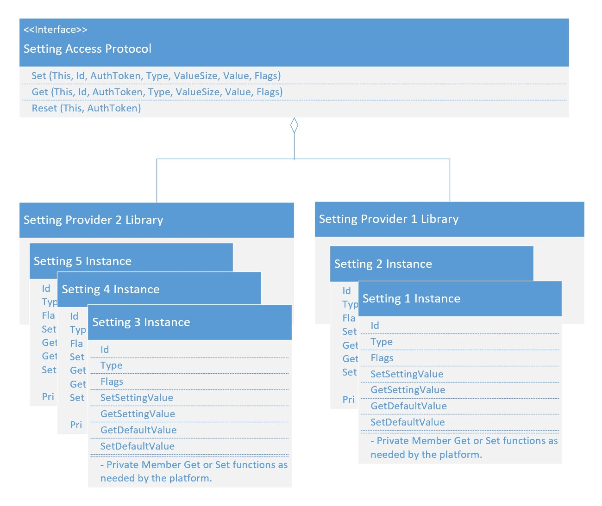
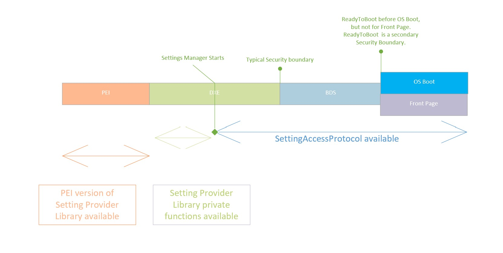

# DFCI Settings Providers

Settings providers are the foundation of DFCI.
Settings providers provide a common method to get and apply a setting.
All of the setting providers are linked to the Settings Manager,which published the
Setting Access Protocol.

All updates to settings that are provided by an anonymous DFCI settings library
should be through the Setting Access protocol.  The Setting Access protocol will
validate the permission of the setting before allowing the setting
to be changed.

## Overview

A setting provider may publish more than one settings. Multiple setting providers are
aggregated and accessed through the DFCI Setting Access Protocol as shown below:



Lets look at what is needed for a single setting in the Setting Provider environment. A
setting provider is an anonymous library linked with the Settings Manager DXE driver. Here
is how the DfciSampleProvider library is linked with the Settings Manager as an anonymous
library:

```ini
 DfciPkg/SettingsManager/SettingsManagerDxe.inf {
  <PcdsFeatureFlag>
     gDfciPkgTokenSpaceGuid.PcdSettingsManagerInstallProvider|TRUE
  <LibraryClasses>
    NULL|DfciPkg/Library/DfciSampleProvider/DfciSampleProviderLib.inf
}
```

Any number of anonymous libraries can be linked with the Settings Manager. Referring to the
DfciSampleProvider code, a setting provider defines a setting as:

```c
DFCI_SETTING_PROVIDER mDfciSampleProviderProviderSetting1 = {
    MY_SETTING_ID__SETTING1,
    DFCI_SETTING_TYPE_ENABLE,
    DFCI_SETTING_FLAGS_NO_PREBOOT_UI,   // NO UI element for user to change
    DfciSampleProviderSet,
    DfciSampleProviderGet,
    DfciSampleProviderGetDefault,
    DfciSampleProviderSetDefault
};
```

This particular setting is a ENABLE/DISABLE type of setting, and is telling DFCI that
there is no UI element for this setting.  When there is no UI element for a setting,
DFCI will set the value to the setting Default Value when DFCI is unenrolled.

Each setting provider library must have a constructor with code that checks the
PCD gDfciPkgTokenSpaceGuid.PcdSettingsManagerInstallProvider.

When the constructor is called with the InstallProvider PCD set to TRUE, the setting
provider needs to register for a notification of the Settings Provider Support Protocol.
When that notification is called, the Settings Provider calls the RegisterProvider method
with each setting that the setting provider provides.

The constructor looks like:

```c
    if (FeaturePcdGet (PcdSettingsManagerInstallProvider)) {
        //Install callback on the SettingsManager gDfciSettingsProviderSupportProtocolGuid protocol
        mDfciSampleProviderProviderSupportInstallEvent = EfiCreateProtocolNotifyEvent (
                    &gDfciSettingsProviderSupportProtocolGuid,
                    TPL_CALLBACK,
                    DfciSampleProviderProviderSupportProtocolNotify,
                    NULL,
                    &mDfciSampleProviderProviderSupportInstallEventRegistration
            );

        DEBUG((DEBUG_INFO, "%a: Event Registered.\n", __FUNCTION__));

        //Initialize the settings store
        Status = InitializeSettingStore ();
        if (EFI_ERROR(Status)) {
            DEBUG((DEBUG_ERROR, "%a: Initialize Store failed. %r.\n", __FUNCTION__, Status));
        }
    }
    return EFI_SUCCESS;
```

The notify routine looks like:

```c
    //locate protocol
    Status = gBS->LocateProtocol (&gDfciSettingsProviderSupportProtocolGuid, NULL, (VOID**)&sp);
    if (EFI_ERROR(Status)) {
      if ((CallCount++ != 0) || (Status != EFI_NOT_FOUND))
      {
        DEBUG ((DEBUG_ERROR, "%a() - Failed to locate gDfciSettingsProviderSupportProtocolGuid in notify.  Status = %r\n", __FUNCTION__, Status));
      }
      return;
    }

    Status = sp->RegisterProvider (sp, &mDfciSampleProviderProviderSetting1);
    if (EFI_ERROR (Status)) {
        DEBUG((DEBUG_ERROR, "Failed to Register %a.  Status = %r\n", mDfciSampleProviderProviderSetting1.Id, Status));
    }

    //We got here, this means all protocols were installed and we didn't exit early.
    //close the event as we don't need to be signaled again. (shouldn't happen anyway)
    gBS->CloseEvent(Event);
```

## Setting Provider

When you are writing your setting provider, keep in mind that other, similarly written
libraries, are linked together. Define each common routine as STATIC to avoid conflicts
with other providers.
Refer to the UEFI general timeline here:



Quite a few settings are only needed in late DXE, BDS or FrontPage.  You may need access to settings
values in PEI or in DXE prior to the starting of SettingsManager.
To do this, add private methods to your settings library. Doing this will keep a single piece of code
that accesses the nonvolatile storage for the settings.
Here is a sample local setting function in the Dfci Sample Provider:

```c
// Here is where you would have private interfaces to get and or set a settings value

EFI_STATUS
OEM_GetSampleSetting1 (
  OUT UINT8    *LocalSetting
  ) {

    UINTN       LocalSettingsSize;
    EFI_STATUS  Status;

    LocalSettingSize = sizeof (*LocalSetting);

    Status = DfciSampleProviderGet (
                    &mDfciSampleProviderProviderSetting1,
                    &LocalSettingSize,
                    &LocalSetting
                    );

    return Status;
}
```

---

## Copyright

Copyright (C) Microsoft Corporation. All rights reserved.  
SPDX-License-Identifier: BSD-2-Clause-Patent
